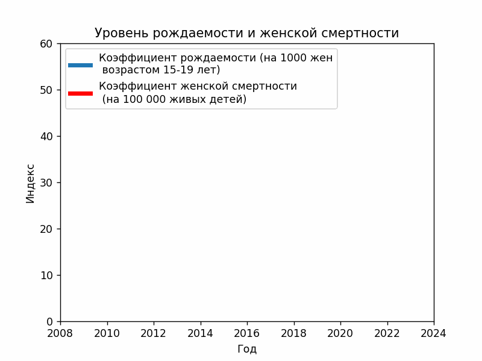

# birth-rate-and-child-mortality

## Installation

Clone the repository
```shell
https://github.com/open-data-kazakhstan/birth-rate-and-child-mortality.git
```

Requires Python 3.8.10 

Create a virtual environment and activate it 
```bash
pip install venv
python -m venv /path/to/localrepo
```

Swicth to venv directory by using cd comand
```bash
cd /path/to/localrepo
Scripts/activate
```

Install dependecies in venv by using pip
```bash
pip install -r requirements.txt
```

Run the project:
```bash
python scripts/main.py
```
## Data 

Data collected from https://gender.stat.gov.kz/ru/category/12

We extracted the data from these sources and put it in the acrhive folder as birthrate.xlsx .

We processed the original data to bring them back to normal, and extracted several aggregated datasets from them into the Data folder:

* `Data/birthrate.csv`
* `Data/datapackage.json` - contains all the key information about our dataset

## Scripts

* `main.py ` - runs the script

## Visualization

The end result is visualized data showing the birth rate and female mortality




## License

This dataset is licensed under the Open Data Commons [Public Domain and Dedication License][pddl].

[pddl]: https://www.opendatacommons.org/licenses/pddl/1-0/
